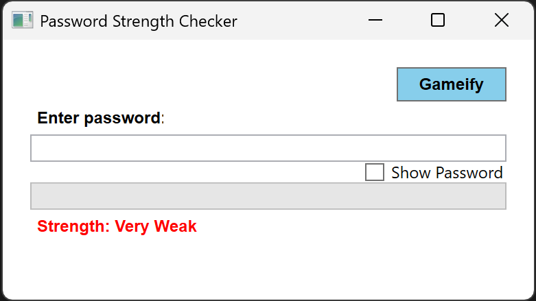
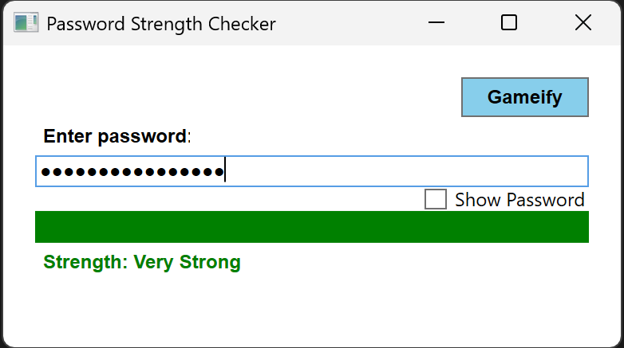

# Password Strength Checker

  

A WPF app that evaluates password strength in real-time using:
- Zxcvbn algorithm for standard evaluation
- Visual feedback (progress bar, color-coded labels)
- Custom "Secret" mode that evaluates strength based on an ruleset (Have fun with it!)

Requires:
- .NET 6.0+
- Visual Studio 2022 (or VS Code with C# extension)
